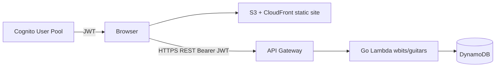

# Architecture

## System overview



| Component | Repo | Hosting |
|-----------|------|---------|
| **guitars-webapp** (this repo) | `wbits/guitars-webapp` | S3 + CloudFront |
| **GuitarCollection API** | `wbits/guitars` | API Gateway + Lambda |
| **Market crawler** | `wbits/guitars` | GitHub Actions (weekly) |

There is **no backend in this repo**. The webapp is a thin client; API behavior is implemented in Go and mirrored in `src/domain/` (zod schemas).

## Stack

- Vite + React 18 + TypeScript (strict)
- react-router-dom v6
- TanStack Query (React Query v5)
- react-hook-form + zod
- Tailwind CSS (no UI kit)
- Native `fetch` via `src/api/client.ts`
- Amazon Cognito (production) or bearer token (local dev)
- Vitest + @testing-library/react

## Source layout

```
src/
├── api/         fetch wrapper + typed CRUD helpers and React Query hooks
├── components/  AuthGate, GuitarForm, GuitarMosaicGrid, PictureGallery, …
├── domain/      zod schema + TS types mirroring the API contract
├── lib/         Cognito auth, token resolution, money conversion + formatting
├── pages/       routes: GuitarList, GuitarNew, GuitarView, GuitarEdit, Login, …
├── App.tsx      shell layout + nav
└── main.tsx     React Query provider + router + AuthGate wiring
```

## Web routes

| Path | Purpose |
|------|---------|
| `/` | Redirects to `/guitars` |
| `/guitars` | Mosaic overview, sorted by brand |
| `/guitars/new` | Create form |
| `/guitars/:id` | Detail view + picture gallery + delete modal |
| `/guitars/:id/edit` | Edit form (prefilled) |
| `/login` | Cognito sign-in (when Cognito is configured) |
| `/register` | Cognito registration |
| `/settings` | Token info / sign-out helper |

All collection routes are wrapped in `<AuthGate>`, which requires a valid API credential before rendering.

## Authentication

Production uses **Amazon Cognito**. After sign-in the app stores the Cognito **ID token** in `sessionStorage` and sends it as `Authorization: Bearer <token>` on every API request. The API maps the token to a user id (`sub`) and scopes the collection to that caller.

When Cognito env vars are **not** set at build time, the app falls back to a shared bearer token for local development:

1. Build-time `VITE_GUITARS_BEARER_TOKEN`, or
2. Runtime token pasted on `/settings` (stored in `sessionStorage`).

Do not bake a production bearer token into the bundle — use Cognito instead.

Env vars and setup: [runbook.md](runbook.md).

## Static hosting (this repo)

`template.yaml` provisions:

- S3 bucket (private, Origin Access Control)
- CloudFront distribution
- CloudFront Function: SPA path rewrite (no file extension → `/index.html`)
- 403/404 → 200 + `/index.html` error mappings

Deploy and CI details: [runbook.md](runbook.md).

## MCP (planned)

AI agent access via MCP — see [plans/mcp-server.md](plans/mcp-server.md).

- **Phase 1:** local stdio adapter in `mcp/` (this repo), calls REST API
- **Phase 2:** hosted MCP on API Gateway + Cognito (`wbits/guitars` repo)

## Related documentation

| Topic | File |
|-------|------|
| API endpoints & payloads | [api-contract.md](api-contract.md) |
| Dev, deploy, CI | [runbook.md](runbook.md) |
| Fixed choices | [decisions.md](decisions.md) |
| Schema source of truth | [`src/domain/`](../src/domain/) |
