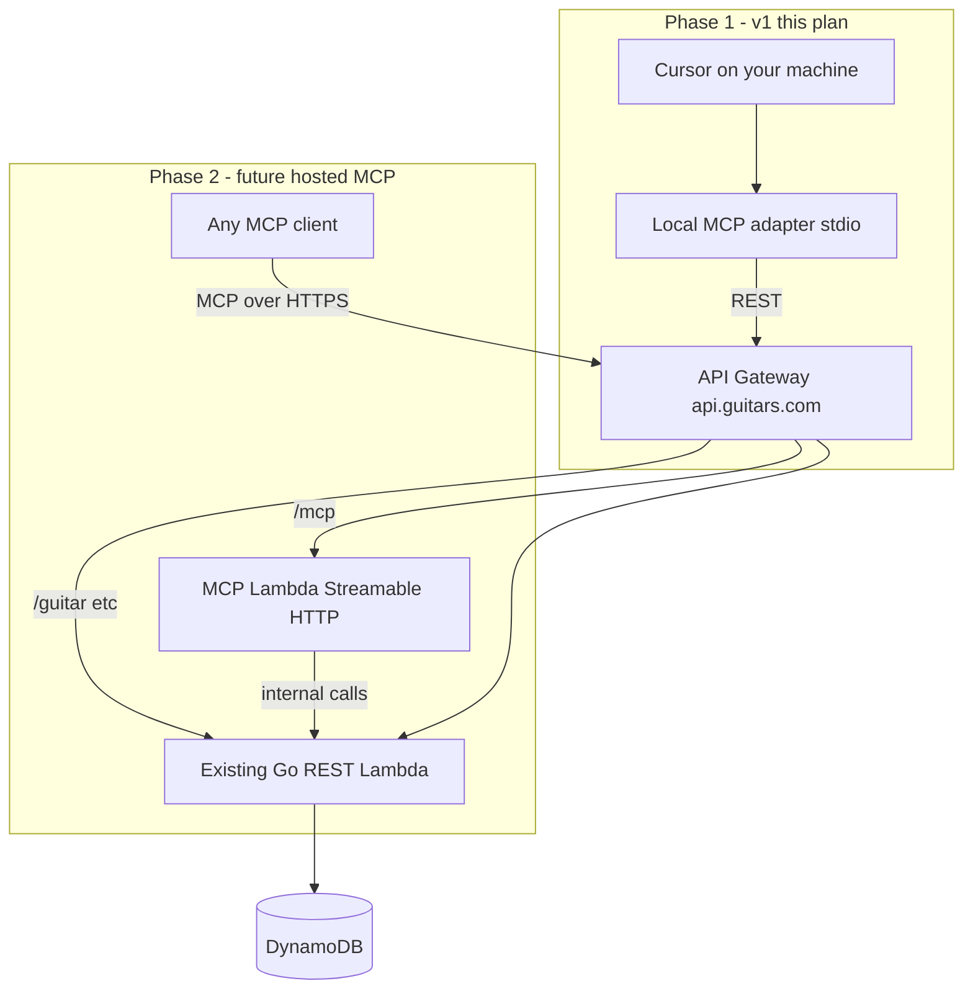

# Guitars MCP Server Plan

> Mirrored from Cursor global plan (`~/.cursor/plans/Guitars MCP Server-f44aa962.plan.md`) on 2026-06-21.  
> Track progress in [`.agents/backlog.md`](../backlog.md).

## Context

This repo is a **frontend-only** React app. The actual API lives in the separate [`wbits/guitars`](https://github.com/wbits/guitars) backend.

**Long-term goal:** any guitars.com user with an account can connect an AI agent to their collection.

**Why not make API Gateway "become" the MCP server in v1?** Because API Gateway and MCP speak different protocols. Gateway routes plain HTTP to Lambda; MCP clients expect JSON-RPC tool negotiation (`list_tools`, `call_tool`, etc.) over **stdio** or **Streamable HTTP**. Your existing routes (`POST /guitar`, `GET /guitar`, …) are REST — they cannot be called directly as MCP tools without an adapter layer.

**The eventual target architecture does leverage API Gateway** — by adding a **new MCP endpoint** on the same Gateway, with the same Cognito auth, fronting a new handler. The REST API stays for the webapp; MCP is an additional interface to the same backend.



## Phased approach

### Phase 1 (v1) — local MCP adapter

Ship quickly on your machine. Validates tool schemas, auth flow, and agent UX before investing in AWS deploy.

- **Runs on:** your Mac (Cursor stdio child process)
- **Calls:** existing REST API over HTTPS with bearer token
- **Good for:** you, today; iterating on tool design
- **Limitation:** each user must install/configure locally; not suitable for "any guitars.com user"

### Phase 2 (future) — hosted MCP on API Gateway

This is how you reach "anyone with an account." **Same API Gateway infrastructure, new MCP route.**

| Piece | What changes |
|-------|--------------|
| API Gateway | Add route e.g. `POST /mcp` (Streamable HTTP) on existing API |
| Lambda | New Node.js Lambda implementing MCP Streamable HTTP transport |
| Auth | Reuse existing Cognito JWT authorizer — user's token scopes to their collection |
| Go REST Lambda | Unchanged — webapp keeps using it; MCP Lambda calls it internally |
| Webapp | Unchanged |

**Why a separate MCP Lambda (not extend the Go handler)?**

- MCP SDK is mature in TypeScript/Node; Go MCP support is thinner
- Keeps MCP protocol concerns isolated from existing REST routing
- Phase 1 `mcp/` package tool logic can be reused — only the transport layer changes (stdio → Streamable HTTP)

**What users would configure (Phase 2):**

```json
{
  "mcpServers": {
    "guitars": {
      "url": "https://api.guitars.com/mcp",
      "headers": { "Authorization": "Bearer <cognito-id-token>" }
    }
  }
}
```

**Phase 2 lives in the `wbits/guitars` repo** (SAM template, new Lambda, API Gateway route) — not guitars-webapp. Phase 1 code should be structured so tool handlers and API client are transport-agnostic and portable.

## Why REST endpoints cannot simply become MCP tools

| | REST (`POST /guitar`) | MCP (`create_guitar` tool) |
|--|----------------------|---------------------------|
| Protocol | HTTP + JSON body | JSON-RPC over stdio or Streamable HTTP |
| Discovery | OpenAPI/docs | `list_tools` with JSON Schema per tool |
| Client | Browser, fetch | Cursor, Claude Desktop, other MCP hosts |
| Auth | Bearer header | Same Bearer header (Phase 2) |

An MCP server is an **adapter** that translates tool calls into your domain operations. That adapter can run locally (Phase 1) or on Lambda behind Gateway (Phase 2) — but Gateway itself never "becomes" MCP; it **routes to** an MCP-capable handler.

## Where it runs (infrastructure)

**Phase 1:** The MCP layer is **not deployed to AWS.** It runs as a **local Node.js process** on whichever machine is running the AI client (typically your Mac, where Cursor is installed).

| Component | Where it runs | Deployed? |
|-----------|---------------|-----------|
| MCP server (`mcp/`) | Local machine (Cursor child process) | **No** |
| GuitarCollection API | AWS (API Gateway + Lambda) | **Yes** |
| Webapp static site | AWS (S3 + CloudFront) | **Yes** |
| Market crawler | GitHub Actions | **Yes** — only if `trigger_market_crawl` is used |

**Why local for v1:** fastest path to working tools; de-risks schema design before SAM/Lambda work.

**Phase 2 target:** MCP Streamable HTTP on existing API Gateway + Cognito, new Lambda in `wbits/guitars`.

## MCP tools (v1)

| Tool | API call | Notes |
|------|----------|-------|
| `create_guitar` | `POST /guitar` | Required fields: brand, typeName, buildYear, price, priceCurrency |
| `update_guitar` | `PUT /guitar/{id}` | Full replace semantics (same as webapp edit form) |
| `list_guitars` | `GET /guitar` | Helper so agents can find IDs before updating |
| `get_guitar` | `GET /guitar/{id}` | Helper to read current state before patching |

**Input design for agents:** accept human-friendly `price` as a decimal major unit (e.g. `1999.00`) and convert to minor units (cents) using the same logic as `src/lib/money.ts`. Reuse validation rules from `src/domain/guitar.ts`.

**Output:** return structured JSON text content with the parsed `Guitar` object on success; on API errors, return a clear message including HTTP status and `{ error: "..." }` body when present.

## Authentication

MCP server reads env vars at startup (fail fast if missing):

| Variable | Purpose |
|----------|---------|
| `GUITARS_API_BASE_URL` | API base URL (no trailing slash) |
| `GUITARS_BEARER_TOKEN` | JWT or dev bearer token sent as `Authorization: Bearer ...` |

Cognito username/password auto-login is **out of scope for v1**.

## Market crawl (optional)

There is **no REST endpoint** to run a crawl. Crawls execute via the Go CLI in the `guitars` repo, scheduled weekly or triggered manually in GitHub Actions (`workflow_dispatch` with optional `guitar_id` input).

### Proposed tool: `trigger_market_crawl`

- Runs: `gh workflow run crawl.yml --repo wbits/guitars [-f guitar_id=<id>]`
- Requires: `gh` CLI authenticated; optional `GITHUB_REPO` env (default `wbits/guitars`)
- If not configured, skip registration or return a helpful error

## Implementation structure

```
mcp/
├── package.json
├── tsconfig.json
├── src/
│   ├── index.ts          # stdio server entry
│   ├── config.ts         # env validation
│   ├── api-client.ts     # Node fetch wrapper
│   ├── tools/
│   │   ├── guitars.ts
│   │   └── crawl.ts
│   └── schemas.ts
└── README.md
```

**Key technical choices:**

- Use stable `@modelcontextprotocol/sdk` (v1) with `StdioServerTransport` for Phase 1
- Structure tool handlers and API client as **transport-agnostic modules**
- Log diagnostics to **stderr only**
- Build to `mcp/dist/index.js`

## Tests

Vitest in `mcp/`:

- Config validation (missing env vars)
- API client error parsing (mock `fetch`)
- Price major→minor conversion in tool input mapping
- Crawl tool: mock subprocess / skip when not configured

## Out of scope (v1)

- Hosted MCP on API Gateway (Phase 2)
- Cognito login flow inside MCP
- Picture upload via `/upload/presign`
- Backend `POST /admin/market-crawl` endpoint
- Publishing MCP server to npm

## Summary of deliverables

1. New `mcp/` TypeScript MCP server package
2. Tools: `create_guitar`, `update_guitar`, `list_guitars`, `get_guitar`
3. Optional `trigger_market_crawl` via GitHub Actions dispatch
4. README with build steps and Cursor wiring
5. Unit tests for core logic
